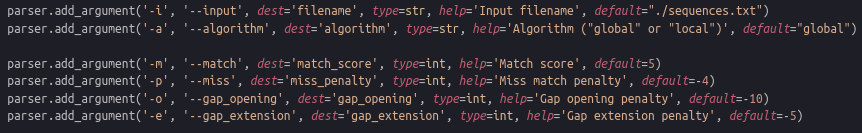
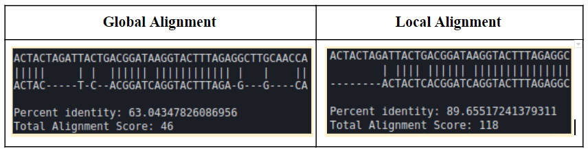

# pairwise-sequence-alignment
Pairwise sequence alignment implementations such as global alignment (Needleman-Wunsch algorithm) and local alignment (Smith-Waterman algorithm)


## Usage

### Args



### Default command

```python
python pairwise_sequence_alignment.py -i ./sequences.txt -a global -m 5 -p -4 -o -10 -e -5
```

## Example 

Aligned the sequences of Gene A and Gene B given in the _"sequences.txt"_, once with global and once with local alignment.
(parameters: match= 5, mismatch= -4, gap open= -10, gap extend= -5)



